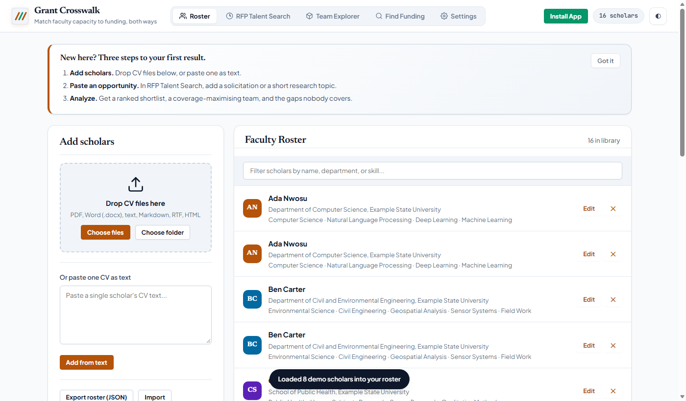
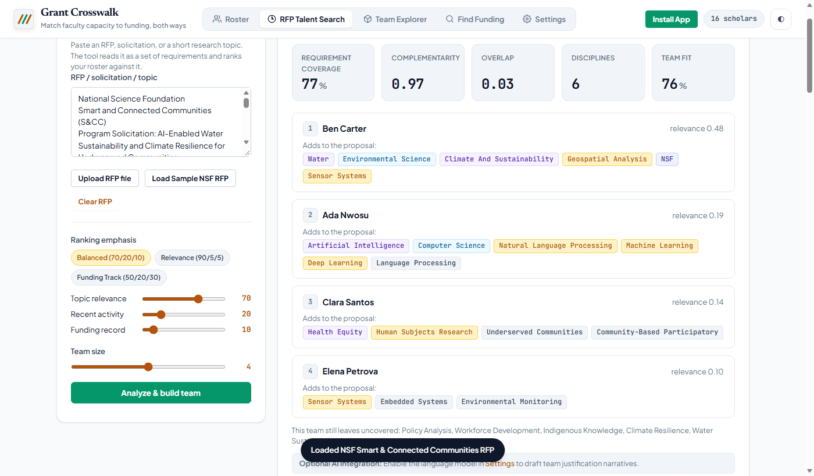
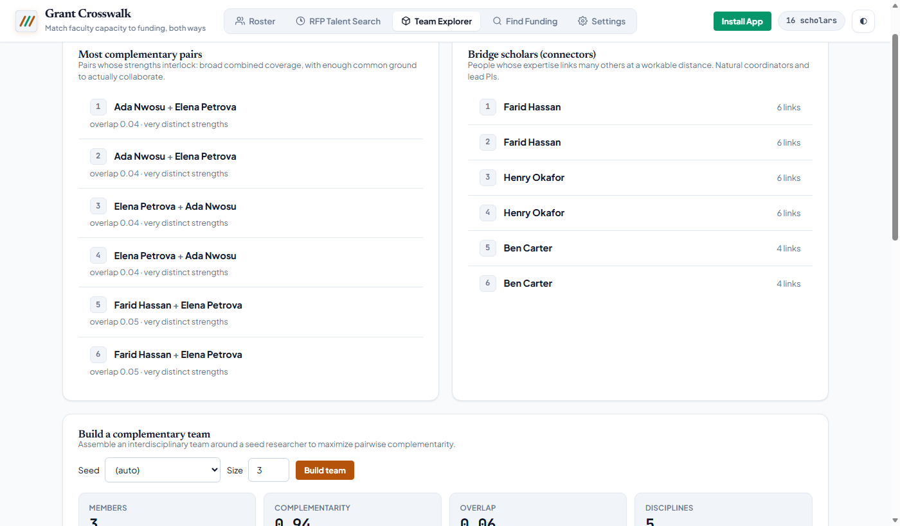
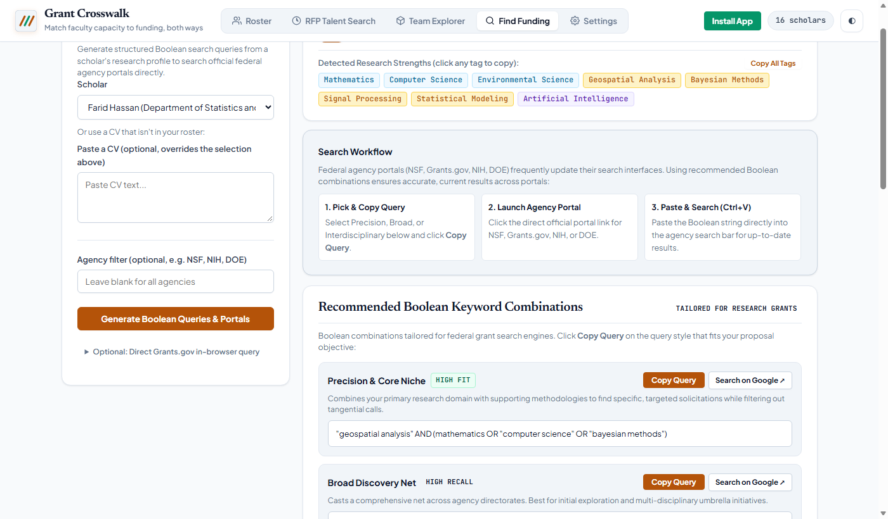
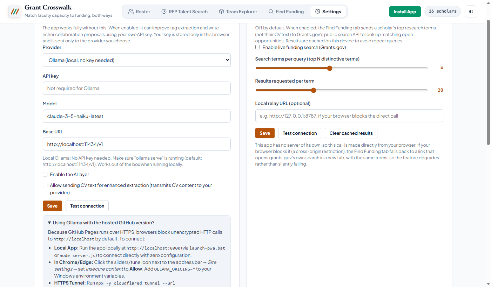

# Grants Crosswalk
## Institutional Research Development & Interdisciplinary Team Assembly Platform

A presentation guide and LinkedIn showcase tailored for **Vice Presidents of Research (VPR)**, **Directors of Sponsored Programs (OSP)**, and **Graduate School Deans**.

---

### Executive Overview: What Is the App?

**Grants Crosswalk** is an on-premise, privacy-first Research Development intelligence platform designed for universities. It bridges academic departmental silos by pairing institutional faculty capacity with federal funding solicitations (NSF, NIH, DOE, DARPA, EPA, NEH).

Unlike traditional academic directories that rely on manual keyword searches, Grants Crosswalk ingests faculty CVs (PDF, Word, text), extracts structured research methodologies, thematic capabilities, and disciplinary tags, and matches them bidirectionally:
1. **RFP to Faculty Team (Macro-Level):** Evaluates multi-million-dollar interdisciplinary solicitations, ranks faculty expertise, algorithmically assembles balanced multi-PI teams that maximize requirement coverage while minimizing overlap, and identifies institutional capacity gaps.
2. **Faculty Scholar to Funding (Micro-Level):** Analyzes individual faculty profiles to construct tailored, portal-ready Boolean query strings (Precision, Broad, Interdisciplinary) and generates direct deep-links to federal agency databases.
3. **Institutional Privacy by Design:** 100% of CV parsing, scoring, and ranking runs client-side in the browser or via on-premise local LLMs (Ollama). Faculty data and pre-submission proposal ideas never touch third-party commercial clouds without explicit institutional consent.

---

### High-Resolution Feature Walkthrough

#### 1. Automated Faculty Capability Profiling
Ingests raw faculty CVs and extracts structured methodologies, domain disciplines, and facilities without manual data entry.



* **Key Value for Deans & Research Leaders:** Instant visibility into the collective capability of your faculty across colleges and departments.
* **Core Features:** Drag-and-drop batch ingestion of PDFs/DOCX, automatic disambiguation of methods vs. disciplines, and real-time roster filtering.

---

#### 2. RFP Talent Search & Algorithmic Team Assembly
Paste any complex solicitation text (e.g., NSF Smart & Connected Communities) to immediately rank candidate researchers and assemble a high-performing multi-investigator team.



* **Key Value for Research Development:** Accelerates multi-PI team formation from weeks of manual networking to minutes of algorithmic matching.
* **Core Features:**
  - **Requirement Coverage Metric:** Shows the exact percentage of solicitation requirements met by the proposed team (e.g., 77% coverage across 6 disciplines).
  - **Complementarity & Overlap Scoring:** Balances interdisciplinary breadth with necessary domain depth.
  - **Uncovered Gap Diagnostics:** Explicitly flags unaddressed requirements (e.g., policy analysis, community participatory research) so PIs know who to recruit next.

---

#### 3. Cross-Departmental Collaboration & Network Discovery
Identifies hidden natural connectors ("bridge scholars") and high-synergy faculty pairs who have never co-authored before.



* **Key Value for Deans & Centers:** Proactively seeds seed-grant programs and interdisciplinary research centers before solicitations drop.
* **Core Features:** Identifies bridge scholars who link distinct academic disciplines and suggests concrete collaboration angles between disparate departments.

---

#### 4. Scholar Funding Hub & Precision Boolean Search
Generates tailored, syntax-valid Boolean query strings for federal search engines and provides direct links to agency search engines.



* **Key Value for Sponsored Programs Officers:** Equips grant coordinators and early-career faculty with high-precision search strings that filter out grant noise and surface high-probability opportunities.
* **Core Features:** 1-click query copying for Grants.gov, NSF, NIH, and DOE portals, structured by Precision, Broad, and Interdisciplinary modes.

---

#### 5. Zero-Trust Security & On-Premise Local AI
Flexible AI architecture supporting on-premise local models (Ollama) or institutional API keys (Gemini, Claude, OpenAI, Grok).



* **Key Value for University CIOs & Legal Counsel:** Zero external data leakage. All credentials and research dossiers remain strictly inside the user's browser or university network.
* **Core Features:** Full offline operation as an installable Progressive Web App (PWA), optional on-premise Ollama integration, and complete data hygiene controls.

---

### LinkedIn Post Draft (Ready to Share)

```text
Assembling competitive multi-investigator grant teams across academic silos shouldn't rely on serendipity or hallway conversations.

To my colleagues in university research leadership—Vice Presidents of Research, Directors of Sponsored Programs, and Graduate School Deans:

Winning major multi-million-dollar federal awards (NSF, NIH, DOE, DARPA) requires assembling interdisciplinary teams with complementary strengths, minimal redundancy, and zero unaddressed requirements. Yet Research Development staff and department chairs often spend weeks manually scouring faculty directories to identify the right collaborators.

We developed Grants Crosswalk to solve this challenge:

🎯 Algorithmic Team Assembly: Ingests complex federal RFPs and mathematically optimizes team composition, reporting exact requirement coverage (e.g. 77% coverage across 6 disciplines) and faculty complementarity.
🔍 Institutional Gap Diagnostics: Pinpoints the specific capabilities an RFP calls for that your assembled team lacks—so you know exactly who to recruit or partner with.
🌐 Cross-Departmental Synergy: Uncovers "bridge scholars" and complementary pairings across departments that haven't traditionally collaborated.
⚡ Precision Funding Hub: Transforms individual faculty CVs into targeted Boolean search strategies for Grants.gov, NSF, NIH, and DOE portals.
🔒 100% Privacy by Design: Operates client-side as an installable Progressive Web App with optional on-premise AI (Ollama). Your faculty's unpublished research concepts and CVs never leave your campus.

Explore the open tool here: https://professorgeorge.github.io/grantscrosswalk/

How is your institution currently mapping faculty capacity to interdisciplinary federal funding opportunities? Let's connect and discuss.

#HigherEducation #ResearchAdministration #UniversityResearch #SponsoredPrograms #GrantFunding #InterdisciplinaryResearch #ResearchDevelopment #NSF #NIH
```
